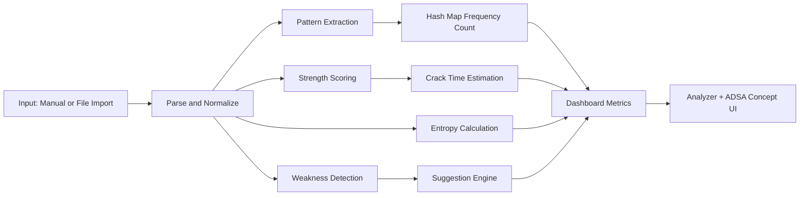

# Password Security Analyzer

[](https://react.dev/)
[](https://vitejs.dev/)
[](https://developer.mozilla.org/en-US/docs/Web/JavaScript)
[](#)
[](#adsa-concepts-implemented)

A production-style security auditing web app built with React that analyzes password quality using **ADSA concepts**: hash maps, string processing, pattern analysis, entropy estimation, and complexity-aware design.

This project is designed as both:
- a practical cybersecurity utility
- an academic ADSA demonstration with real-world relevance

## Table Of Contents

- [Overview](#overview)
- [Feature Highlights](#feature-highlights)
- [ADSA Concepts Implemented](#adsa-concepts-implemented)
- [Scoring Model](#scoring-model)
- [System Design](#system-design)
- [Time Complexity](#time-complexity)
- [Tech Stack](#tech-stack)
- [Project Structure](#project-structure)
- [Getting Started](#getting-started)
- [Usage Flow](#usage-flow)
- [Security And Privacy Notes](#security-and-privacy-notes)
- [Screenshots](#screenshots)
- [Roadmap](#roadmap)
- [Author](#author)

## Overview

The app analyzes multiple passwords in batch mode and returns:
- normalized password patterns
- frequency distribution of those patterns
- strength score out of 100
- weakness diagnostics
- entropy value with interpretation
- estimated crack-time category
- stronger suggested password for each weak input

It also supports:
- file import (.txt, .csv, .json, .docx)
- Google Password CSV import (export-based)
- strong random password generation
- ADSA concept page directly inside the app

## Feature Highlights

### 1. Password Strength Scoring (0 to 100)
- rewards diversity and sufficient length
- penalizes common weak structures
- produces actionable weakness reasons

### 2. Crack Time Estimation
Based on entropy + risky signals:
- Instantly
- Seconds
- Hours
- Years

### 3. Weakness Detection
Detects:
- too short passwords
- missing uppercase
- missing lowercase
- missing numbers
- missing symbols
- repeating characters
- sequential sequences (123, 321, etc.)
- common password dictionary matches

### 4. Smart Suggestion Engine
Transforms weak passwords to stronger candidates by:
- symbol substitutions
- uppercase injection
- numeric enrichment
- randomized hardening

### 5. Strong Password Generator
Generates cryptographically stronger random passwords using browser crypto API when available.

### 6. Entropy Analysis
Displays entropy in bits and classifies it into:
- Low entropy
- Moderate entropy
- Good entropy
- High entropy

### 7. Professional Dashboard UI
- score bars
- summary metrics
- entropy insights
- risk highlighting
- responsive card-based design

## ADSA Concepts Implemented

### Hash Map
Used for:
- common password fast lookup (dictionary check)
- pattern frequency counting

Why it matters:
- average-case $O(1)$ lookup/update
- scalable for large input batches

### String Processing
Each character is mapped to a structural token:
- uppercase -> A
- lowercase -> a
- digit -> #
- special -> @

Example:
- Rishi@123 -> Aaaaa@###

This enables pattern clustering independent of literal password text.

### Entropy Approximation

$$
H = L \cdot \log_2(C)
$$

Where:
- $L$ = password length
- $C$ = effective character-set size

### Rule-Based Scoring Algorithm
Weighted additive + subtractive model:
- add points for stronger composition
- subtract points for predictable/risky behavior

## Scoring Model

Current scoring logic includes:
- length bands
- uppercase presence
- lowercase presence
- digit presence
- symbol presence
- penalties for repetition
- penalties for sequential patterns
- high penalty for common password map hit

The result is clamped to range $[0, 100]$.

## System Design



## Time Complexity

Let:
- $N$ = number of passwords
- $L$ = average password length

Then:
- pattern extraction per password: $O(L)$
- dictionary lookup per password: $O(1)$ average
- weakness checks per password: $O(L)$
- full batch analysis: $O(N \cdot L)$

Space:
- pattern frequency map: $O(P)$ where $P$ is number of unique patterns

## Tech Stack

- React 18
- Vite 5
- JavaScript (ES Modules)
- CSS (custom dashboard styling)
- Mammoth (docx extraction in browser)

## Project Structure

```text
Adsa/
  index.html
  package.json
  README.md
  src/
    App.js
    App.jsx
    main.jsx
    index.css
```

## Getting Started

### 1. Clone

```bash
git clone https://github.com/Rishikesh10925/Adsa_password.git
cd Adsa_password
```

### 2. Install

```bash
npm install
```

### 3. Run Dev Server

```bash
npm run dev
```

### 4. Build

```bash
npm run build
```

### 5. Preview Production Build

```bash
npm run preview
```

## Usage Flow

1. Open Analyzer tab.
2. Paste passwords line-by-line or import from file.
3. Click Analyze Security.
4. Review score, entropy, crack time, weaknesses, and suggestions.
5. Use generated strong password when needed.
6. Open ADSA Concept Page for algorithm explanation and complexity mapping.

## Security And Privacy Notes

- Browser apps cannot directly read saved Chrome or Google passwords.
- Use CSV export from Google Password Manager for import.
- Never commit real password data to Git.
- Recommended ignore entries:

```gitignore
node_modules
dist
.env
*.csv
*.txt
```

## Screenshots

Add screenshots after pushing:
- Dashboard overview
- Detailed table with entropy and weaknesses
- ADSA concept page

Suggested naming:
- docs/screenshots/dashboard.png
- docs/screenshots/details.png
- docs/screenshots/adsa-concept.png

## Roadmap

- sortable columns and advanced filters
- report export (CSV/PDF)
- reusable utility modules + unit tests
- accessibility pass (keyboard and ARIA audit)
- optional dark theme

## Author

Rishikesh


